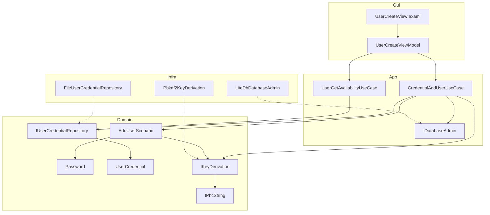
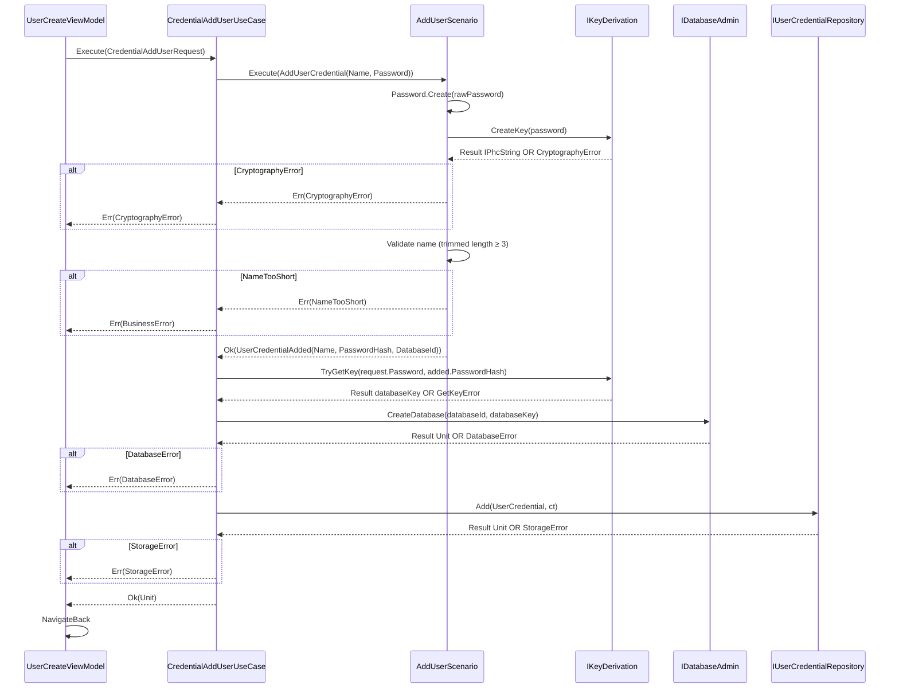
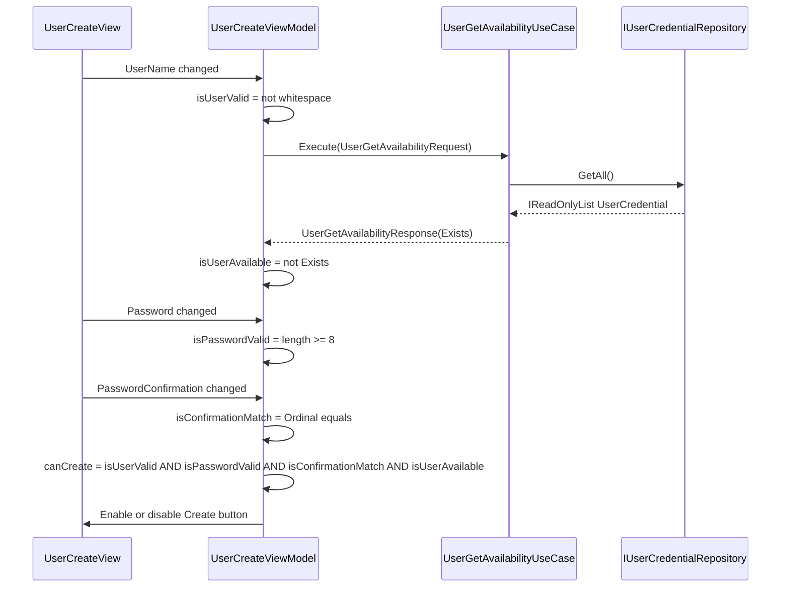

# Technical Design Document: Add User

## Overview

The Add User feature enables individual investors to register new user profiles in PatrimonioTech. Upon registration, the domain validates credentials (name and password rules) and derives an encryption key from the user's password via `IKeyDerivation`. The application layer then orchestrates the persistence side-effects: provisioning a dedicated LiteDB database and durably storing the user's credentials.

Each user's data is fully isolated: the per-user database is identified by a UUID and encrypted using the derived key. Key derivation is abstracted at the domain level via `IKeyDerivation`, which returns an opaque `IPhcString` — the Domain defines the contract and knows that a derived key must exist, but remains agnostic of the specific algorithm (PBKDF2 or otherwise). The concrete implementation lives in Infra.

The feature is implemented across all five projects following the established Clean Architecture conventions: Domain, App, Infra, Gui, and Gui.Desktop.

### Goals

- Provide a dedicated registration form with real-time inline validation (username format, availability, password strength, confirmation match)
- Enforce domain-level credential rules independently of the UI
- Provision and protect a per-user isolated LiteDB data store upon registration
- Durably persist user credentials and reject duplicate usernames

### Non-Goals

- User login and authentication (handled by the Login feature)
- User profile editing or deletion
- Cloud-based or multi-device credential synchronization
- Password recovery or reset flows

## Requirements Traceability

| Requirement | Summary | Components | Interfaces | Flows |
|---|---|---|---|---|
| 1.1 | Display username, password, and confirmation fields | UserCreateView, UserCreateViewModel | — | Registration Form Flow |
| 1.2 | Provide Create and Cancel buttons | UserCreateView, UserCreateViewModel | — | Registration Form Flow |
| 1.3 | Cancel navigates back without creating a user | UserCreateViewModel | IScreen.Router | — |
| 1.4 | Successful submission navigates back | UserCreateViewModel | IScreen.Router | Registration Form Flow |
| 2.1 | Non-whitespace username is format-valid | UserCreateViewModel | — | Validation Flow |
| 2.2 | Empty or whitespace username disables Create | UserCreateViewModel | — | Validation Flow |
| 2.3 | Password < 8 chars shows "Senha muito curta" and disables Create | UserCreateViewModel | — | Validation Flow |
| 2.4 | Password mismatch shows "As senhas não coincidem" and disables Create | UserCreateViewModel | — | Validation Flow |
| 2.5 | Create enabled only when all validations simultaneously pass | UserCreateViewModel | — | Validation Flow |
| 4.1 (UI) | Username < 3 chars shows "Nome muito curto" and disables Create | UserCreateViewModel | — | Validation Flow |
| 3.1 | Username change triggers async availability check | UserCreateViewModel, UserGetAvailabilityUseCase | IUserGetAvailabilityUseCase | Availability Check Flow |
| 3.2 | Taken username shows "Usuário já existe" and disables Create | UserCreateViewModel | — | Availability Check Flow |
| 3.3 | Pending availability check keeps Create disabled | UserCreateViewModel | — | Availability Check Flow |
| 3.4 | Availability check uses case-insensitive locale-aware comparison | UserGetAvailabilityUseCase | IUserCredentialRepository | — |
| 4.1 | Username < 3 chars (after trim) rejects registration | AddUserScenario | IAddUserScenario | — |
| 4.2 | Empty or whitespace password rejects registration | Password value object, AddUserScenario | IAddUserScenario | — |
| 4.3 | Password < 8 chars rejects registration | Password value object, AddUserScenario | IAddUserScenario | — |
| 4.4 | Business rules enforced independently of UI | Domain layer (AddUserScenario, Password, IKeyDerivation) | IAddUserScenario | — |
| 5.1 | User data protected by password-derived key | AddUserScenario, Pbkdf2KeyDerivation | IKeyDerivation | Orchestration Flow |
| 5.2 | Security setup failure rejects registration with no persistence | AddUserScenario | IKeyDerivation | Orchestration Flow |
| 6.1 | Provision dedicated data store on registration | CredentialAddUserUseCase, LiteDbDatabaseAdmin | IDatabaseAdmin | Orchestration Flow |
| 6.2 | Data store creation failure rejects registration with no credentials stored | CredentialAddUserUseCase | IDatabaseAdmin | Orchestration Flow |
| 7.1 | Durably store credentials on successful registration | CredentialAddUserUseCase, FileUserCredentialRepository | IUserCredentialRepository | Orchestration Flow |
| 7.2 | Duplicate username rejects registration without overwriting | FileUserCredentialRepository | IUserCredentialRepository | — |

## Architecture

### Existing Architecture Analysis

The Add User feature extends the existing Credentials feature domain. All components follow established conventions with no architectural deviations:

- **Domain**: Value objects with `Create() → Result<T, TError>`; domain actions as injectable scenarios; `[Union]` FxKit discriminated error types; domain-level service contracts (`IKeyDerivation`) for cryptographic abstractions
- **App**: Versioned use cases at `App/Credentials/v1/{Action}/`; co-located Request/Response/Error records; `[GenerateAutomaticInterface]` produces `I{Name}UseCase`
- **Infra**: Repository implementations with LiteDB models and Mapperly mappers; PBKDF2 key derivation implementation
- **Gui**: `RoutableViewModelBase` with `[Notify]` source-generated properties; `ReactiveUI.Validation` inline rules; `IScreen.Router` navigation
- **DI**: Jab compile-time modules per layer; `[Transient<UserCreateViewModel>]` ensures a fresh instance per navigation

### Architecture Pattern & Boundary Map



**Architecture Integration**:
- Selected pattern: Clean Architecture with feature-first grouping within each layer
- Domain/feature boundaries: Credentials feature owns all user identity and cryptographic security contracts (`IKeyDerivation`, `IPhcString`); Infra provides the implementations
- Existing patterns preserved: value object factories, domain scenarios, versioned use cases, `RoutableViewModelBase`, ReactiveUI.Validation, `Subject<bool>` CanExecute gate
- Steering compliance: no `dynamic` types, `Result`-based error handling throughout, Jab DI restricted to `DependencyInjection` namespaces

### Technology Stack

| Layer | Choice / Version | Role in Feature | Notes |
|---|---|---|---|
| GUI | Avalonia 11 + ReactiveUI | Registration form, routing, compiled bindings | `UserCreateView.axaml` + `UserCreateViewModel` |
| Reactive/Validation | ReactiveUI.Validation | Inline validation messages and CanExecute gating | `this.ValidationRule(...)` + `Subject<bool>` |
| Source Generation | PropertyChanged.SourceGenerator | `[Notify]` for `UserName`, `Password`, `PasswordConfirmation` | Compile-time `INotifyPropertyChanged` |
| Error Handling | FxKit 0.9.1 | `Result<T, TError>` railway pipelines; `[Union]` discriminated errors | `MapErr`, `ToTask`, `CombineLatest` chaining |
| Cryptography | .NET PBKDF2 via `Pbkdf2KeyDerivation` | Implements `IKeyDerivation` (Domain contract); key creation returns `IPhcString`, runtime key retrieval | Singleton; 100,000 iterations default |
| Storage | LiteDB (embedded) | Per-user encrypted database provisioning | `LiteDbDatabaseAdmin`; file keyed by `Guid` |
| Credentials Store | File-based JSON via `FileUserCredentialRepository` | Durable credential persistence | Scoped; full scan for availability check |
| DI | Jab (compile-time) | All service registrations | Transient ViewModel, Scoped use cases, Singleton infra services |

## System Flows

### Registration Orchestration Flow



Key decision: `IKeyDerivation` lives in the Domain layer as a service contract. `AddUserScenario` owns the full credential creation pipeline: it creates the `Password` value object (enforcing password rules), calls `IKeyDerivation.CreateKey(password)` to obtain an opaque `IPhcString`, validates the name, and produces `UserCredentialAdded(Name, PasswordHash: phcString.Value, DatabaseId: newGuid)`. The use case then re-derives the database key via `IKeyDerivation.TryGetKey(rawPassword, passwordHash)` — a second PBKDF2 derivation, acceptable for a one-time registration operation — and passes it to `IDatabaseAdmin.CreateDatabase`. The Domain entity `UserCredential` stores `Name`, `PasswordHash` (as `string`), and `DatabaseId` (as `Guid`); it has no awareness of algorithm, salt, key size, or iteration count.

### Real-Time Validation Flow



`canCreate` is emitted via `Subject<bool> _canCreateSubject` using `CombineLatest` with `DistinctUntilChanged`, ensuring the `Create` command is disabled until the first availability response arrives (satisfying 3.3).

`isUserAvailable` is derived via `Switch()` (not `SelectMany`): `UserName` changes are projected into `IObservable<bool>` availability checks using `Select(name => Observable.FromAsync(ct => availUC.Execute(..., ct))).Switch()`. `Switch()` cancels any in-flight request as soon as a new username value arrives, preventing stale out-of-order responses from incorrectly showing an already-taken username as available.

## Components and Interfaces

### Component Summary

| Component | Layer | Intent | Req Coverage | Key Dependencies | Contracts |
|---|---|---|---|---|---|
| `UserCreateView` | Gui | Registration form: 3 text inputs, Cancelar/Criar buttons; shows spinner inside Criar button and disables inputs while `IsCreating` | 1.1, 1.2 | UserCreateViewModel | State |
| `UserCreateViewModel` | Gui | Reactive validation orchestration and command execution | 1.1–1.4, 2.1–2.5, 3.1–3.3 | IUserGetAvailabilityUseCase, ICredentialAddUserUseCase, IScreen | Service, State |
| `CredentialAddUserUseCase` | App | Orchestrates domain credential creation, database provisioning, and credential persistence | 6.1, 6.2, 7.1, 7.2 | IAddUserScenario, IKeyDerivation, IDatabaseAdmin, IUserCredentialRepository | Service |
| `UserGetAvailabilityUseCase` | App | Determines whether a username is already registered (case-insensitive) | 3.1, 3.4 | IUserCredentialRepository | Service |
| `AddUserScenario` | Domain | Validates name and password, derives key, and produces `UserCredentialAdded` | 4.1, 4.2, 4.3, 4.4, 5.1, 5.2 | IKeyDerivation | Service |
| `Password` | Domain | Value object: non-empty, non-whitespace, minimum 8 characters | 4.2, 4.3 | — | State |
| `UserCredential` | Domain | Entity representing persisted user identity | 6.1, 7.1 | — | State |
| `IUserCredentialRepository` | Domain | Contract for durable credential storage | 7.1, 7.2 | — | Service |
| `IKeyDerivation` | Domain | Contract for key derivation; returns opaque `IPhcString` | 5.1, 5.2 | — | Service |
| `IPhcString` | Domain | Opaque interface representing a password hash; Domain carries it but never interprets its content | 5.1 | — | State |
| `IDatabaseAdmin` | App | Contract for per-user database provisioning | 6.1, 6.2 | — | Service |
| `FileUserCredentialRepository` | Infra | File-based JSON implementation of `IUserCredentialRepository` | 7.1, 7.2 | ILocalPathProvider | Service |
| `Pbkdf2KeyDerivation` | Infra | PBKDF2 implementation of `IKeyDerivation` | 5.1, 5.2 | — | Service |
| `LiteDbDatabaseAdmin` | Infra | LiteDB file creation implementation of `IDatabaseAdmin` | 6.1, 6.2 | ILocalPathProvider, BsonMapper | Service |

---

### Gui Layer

#### UserCreateViewModel

| Field | Detail |
|---|---|
| Intent | Provides reactive state, real-time validation, and registration commands for the user creation form |
| Requirements | 1.1, 1.2, 1.3, 1.4, 2.1, 2.2, 2.3, 2.4, 2.5, 3.1, 3.2, 3.3 |

**Responsibilities & Constraints**
- Owns three `[Notify]` string properties: `UserName`, `Password`, `PasswordConfirmation`
- Computes five `IObservable<bool>` validation streams: `isUserValid` (non-whitespace), `isUserLongEnough` (trimmed length ≥ `AddUserScenario.NameMinLength`), `isPasswordValid` (length ≥ `Password.PasswordMinLength`), `isConfirmationMatch` (Ordinal equality), `isUserAvailable` (async from `UserGetAvailabilityUseCase`)
- Gates `Create` command via `Subject<bool> _canCreateSubject` driven by `CombineLatest` of all five streams with `DistinctUntilChanged`
- Exposes `IsCreating` (bound to `Create.IsExecuting`) to indicate registration is in progress; the View disables all three input fields and replaces the Create button text with a spinner while `IsCreating` is `true`
- Registers four `ValidationRule` instances for inline UI messages: "Usuário já existe" (on `UserName`), "Nome muito curto" (on `UserName`, when trimmed length < `AddUserScenario.NameMinLength`), "Senha muito curta" (on `Password`), "As senhas não coincidem" (on `PasswordConfirmation`)
- On `Create` failure: triggers `ShowError` — a ReactiveUI `Interaction<string, Unit>` — with a localised Portuguese message mapped per error variant (see Error Handling section); the View registers the modal dialog handler inside `WhenActivated`
- Activation lifecycle managed via `this.WhenActivated(OnViewActivated)` + `CompositeDisposable`; `_canCreateSubject` disposed in `Dispose(bool)`

**Dependencies**
- Inbound: `IScreen` — routing host (P0)
- Outbound: `IUserGetAvailabilityUseCase` — async username availability check (P0)
- Outbound: `ICredentialAddUserUseCase` — user registration execution (P0)

**Contracts**: Service [x] / State [x]

##### Service Interface

```csharp
// Commands
ReactiveCommand<Unit, IRoutableViewModel> Cancel;
ReactiveCommand<Unit, Result<Unit, CredentialAddUserError>> Create;

// Interactions
Interaction<string, Unit> ShowError;

// Bindable Properties ([Notify] source-generated)
string UserName { get; set; }
string Password { get; set; }
string PasswordConfirmation { get; set; }
bool IsCreating { get; }  // bound to Create.IsExecuting
```

**Implementation Notes**
- Validation: `isUserAvailable` does not emit until the first `UserGetAvailabilityUseCase` response arrives; `_canCreateSubject` has no initial value, so `Create` is disabled on construction (satisfying 3.3).
- Integration: On `Ok`, `Create` chains into `HostScreen.Router.NavigateBack.Execute()`. On `Err`, `Create` maps the error to a Portuguese message and triggers `ShowError.Handle(message)`; the View handler (registered in `WhenActivated`) presents a modal dialog and completes the interaction.
- Threading: `Create` is constructed as `ReactiveCommand.CreateFromTask(..., outputScheduler: RxApp.MainThreadScheduler)`. Specifying `outputScheduler: RxApp.MainThreadScheduler` causes the task body to execute on a `ThreadPool` thread while result observations are delivered back to the UI thread, ensuring the two synchronous CPU-bound PBKDF2 derivations (in `AddUserScenario` via `IKeyDerivation.CreateKey` and in `CredentialAddUserUseCase` via `IKeyDerivation.TryGetKey`) do not block the UI thread during registration.
- Risks: No debounce on availability check stream — acceptable for a local, no-network use case. Stale response risk is eliminated by using `Switch()` to cancel in-flight checks on each username change.

---

### App Layer

#### CredentialAddUserUseCase

| Field | Detail |
|---|---|
| Intent | Orchestrates domain credential creation, database key re-derivation, database provisioning, and credential persistence as a railway-oriented pipeline |
| Requirements | 6.1, 6.2, 7.1, 7.2 |

**Responsibilities & Constraints**
- Accepts `CredentialAddUserRequest(Name, Password)`
- Delegates credential validation and key derivation to `AddUserScenario` (domain layer)
- Re-derives the database key via `IKeyDerivation.TryGetKey(rawPassword, passwordHash)` for database provisioning
- Executes persistence steps via FxKit `from … select` (LINQ to `Result`); any `Err` short-circuits the chain with no subsequent side effects
- Returns `Task<Result<Unit, CredentialAddUserError>>`

**Dependencies**
- Outbound: `IAddUserScenario` — credential validation and event production (P0)
- Outbound: `IKeyDerivation` — database key re-derivation for provisioning (P0)
- Outbound: `IDatabaseAdmin` — per-user LiteDB database creation (P0)
- Outbound: `IUserCredentialRepository` — durable credential persistence (P0)

**Contracts**: Service [x]

##### Service Interface

```csharp
interface ICredentialAddUserUseCase {
    Task<Result<Unit, CredentialAddUserError>> Execute(
        CredentialAddUserRequest request,
        CancellationToken cancellationToken);
}

record CredentialAddUserRequest(string Name, string Password);

[Union]
partial record CredentialAddUserError {
    partial record BusinessError(AddUserCredentialError Error);
    partial record StorageError(UserCredentialAddError Error);
    partial record DatabaseError(CreateDatabaseError Error);
}
```

**Implementation Notes**
- Integration: `CredentialAddUserUseCase` first calls `AddUserScenario.Execute(AddUserCredential(Name, Password))`, which internally validates credentials and derives the key, returning `UserCredentialAdded(Name, PasswordHash, DatabaseId)`. The use case then re-derives the database key via `IKeyDerivation.TryGetKey(request.Password, added.PasswordHash)` — a second PBKDF2 derivation, acceptable for a one-time registration operation. The database key is passed to `IDatabaseAdmin.CreateDatabase(databaseId, databaseKey)`.
- Threading: Both PBKDF2 derivations (inside `AddUserScenario` via `CreateKey` and inside the use case via `TryGetKey`) are synchronous and CPU-bound. No `Task.Run` offload is needed because the `Create` `ReactiveCommand` in `UserCreateViewModel` is configured with `outputScheduler: RxApp.MainThreadScheduler`, which causes the entire task body to run on a `ThreadPool` thread.
- Risks: If `CreateDatabase` succeeds but `Add` fails with `NameAlreadyExists` (race condition), the LiteDB file remains on disk as an orphan. In practice this path is unreachable from the UI: the ViewModel disables the Create command until the availability check confirms the username is free, and the application is single-user per session. The risk is accepted as negligible.

#### UserGetAvailabilityUseCase

| Field | Detail |
|---|---|
| Intent | Determines whether a given username already exists in the credential store using a case-insensitive locale-aware comparison |
| Requirements | 3.1, 3.4 |

**Responsibilities & Constraints**
- Loads all credentials via `IUserCredentialRepository.GetAll`; performs `StringComparison.CurrentCultureIgnoreCase` match
- Never errors; always returns `UserGetAvailabilityResponse(Exists: bool)`

**Dependencies**
- Outbound: `IUserCredentialRepository` — credential enumeration (P0)

**Contracts**: Service [x]

##### Service Interface

```csharp
interface IUserGetAvailabilityUseCase {
    Task<UserGetAvailabilityResponse> Execute(
        UserGetAvailabilityRequest request,
        CancellationToken cancellationToken);
}

record UserGetAvailabilityRequest(string UserName);
record UserGetAvailabilityResponse(bool Exists);
```

**Implementation Notes**
- Integration: Full `GetAll` scan is acceptable; credential store is local with an expected count under 100.
- Validation: `CurrentCultureIgnoreCase` satisfies the locale-aware requirement (3.4).

---

### Domain Layer

#### AddUserScenario

| Field | Detail |
|---|---|
| Intent | Validates name and password, derives a key via `IKeyDerivation`, and produces a `UserCredentialAdded` domain event |
| Requirements | 4.1, 4.2, 4.3, 4.4, 5.1, 5.2 |

**Responsibilities & Constraints**
- Validates password via `Password.Create(rawPassword)` (enforcing 4.2, 4.3)
- Derives key via `IKeyDerivation.CreateKey(password)` → `IPhcString` (enforcing 5.1, 5.2)
- Validates name: non-null/non-whitespace AND trimmed length ≥ `NameMinLength` (3) (enforcing 4.1)
- On success: assigns a new `Guid` as `DatabaseId`; stores `phcString.Value` as `PasswordHash`
- Returns `Result<UserCredentialAdded, AddUserCredentialError>`; synchronous

**Dependencies**
- Outbound: `IKeyDerivation` — password key derivation (P0)

**Contracts**: Service [x]

##### Service Interface

```csharp
interface IAddUserScenario {
    const int NameMinLength = 3;
    Result<UserCredentialAdded, AddUserCredentialError> Execute(AddUserCredential command);
}

record AddUserCredential(string Name, string Password);

record UserCredentialAdded(string Name, string PasswordHash, Guid DatabaseId);

[Union]
partial record AddUserCredentialError {
    partial record NameTooShort;
    partial record InvalidPassword(PasswordError Error);
    partial record KeyDerivationFailed(CreateKeyError Error);
}
```

#### Password (Value Object)

| Field | Detail |
|---|---|
| Intent | Enforces password quality invariants: non-empty, non-whitespace, minimum 8 characters |
| Requirements | 4.2, 4.3 |

**Contracts**: State [x]

##### State Management

- `PasswordMinLength = 8` (public constant; also referenced by `UserCreateViewModel` for UI validation)
- `Create(string value) → Result<Password, PasswordError>`: `Empty` when null or whitespace; `TooShort` when length < 8
- Immutable: `Value` property holds the validated string

#### IUserCredentialRepository

**Contracts**: Service [x]

```csharp
interface IUserCredentialRepository {
    Task<Result<Unit, UserCredentialAddError>> Add(
        UserCredential userCredential,
        CancellationToken cancellationToken);
    Task<IReadOnlyList<UserCredential>> GetAll(CancellationToken cancellationToken);
}

enum UserCredentialAddError { NameAlreadyExists = 1 }
```

#### IKeyDerivation

Domain-layer service contract for key derivation. The Domain defines the policy ("a credential requires a derived key") while Infra provides the mechanism (PBKDF2).

**Contracts**: Service [x]

```csharp
interface IKeyDerivation {
    Result<IPhcString, CreateKeyError> CreateKey(Password password);
    Result<string, GetKeyError> TryGetKey(string password, string passwordHash);
}
```

#### IPhcString

Domain-layer opaque interface representing a password hash. The Domain carries it but never interprets its content — it only calls `ToString()` to obtain the serialized string for `UserCredentialAdded`. The concrete implementation (`PhcString` class with parsing logic) lives in Infra.

**Contracts**: State [x]

```csharp
interface IPhcString {
    string ToString();
}
```

#### IDatabaseAdmin

**Contracts**: Service [x]

```csharp
interface IDatabaseAdmin {
    Result<Unit, CreateDatabaseError> CreateDatabase(Guid databaseId, string databaseKey);
}
```

#### Pbkdf2PhcString

Infra-layer class implementing `IPhcString`, specific to PBKDF2. Supports both construction from derivation parameters (used by `Pbkdf2KeyDerivation.CreateKey` after key derivation) and parsing a stored PHC string (used when loading credentials).

```csharp
class Pbkdf2PhcString : IPhcString {
    // Construction from derivation parameters (used by CreateKey)
    public Pbkdf2PhcString(HashAlgorithmName algorithm, int iterations, int keyLength, ReadOnlySpan<byte> salt, ReadOnlySpan<byte> hash);

    // Parsing a stored PHC string (used when loading credentials)
    public static Result<Pbkdf2PhcString, PhcStringError> Parse(string value);

    // Serializes to PHC string format: $pbkdf2-{alg}$i={iterations},l={keyLength}${salt}${hash}
    public override string ToString();
}
```

---

### Infra Layer

#### FileUserCredentialRepository

| Field | Detail |
|---|---|
| Intent | File-based durable credential store; enforces unique username constraint at write time |
| Requirements | 7.1, 7.2 |

**Implementation Notes**
- Integration: `Add` reads the full list, checks uniqueness (`CurrentCultureIgnoreCase` — same strategy as `UserGetAvailabilityUseCase`), appends the new record, and writes atomically via temp-file swap (see Write strategy below). Returns `UserCredentialAddError.NameAlreadyExists` on duplicate.
- File path: `{SpecialFolder.ApplicationData}\PatrimonioTech\databases.json`; file is auto-created as `[]` on first access.
- Write strategy: serialize to a `.tmp` sibling file first, then call `File.Replace(tmpPath, configPath, backupPath)` where `backupPath` is `configPath + ".bak"`. A crash mid-serialization leaves the original file intact; `File.Replace` atomically swaps and preserves the previous version as the backup.
- Error recovery: corrupt JSON (detected on read via `JsonException`) triggers a restore attempt from the `.bak` sibling if present; if the backup is also absent or corrupt, the store resets to `[]`.
- Mapping: `UserCredentialModel` (JSON document) ↔ `UserCredential` (domain entity) via Mapperly source-generated mapper (`UserCredentialModelMapper`). Property names are serialized as camelCase via `JsonSerializerDefaults.Web`.

#### Pbkdf2KeyDerivation

| Field | Detail |
|---|---|
| Intent | PBKDF2 implementation of `IKeyDerivation`; derives and verifies encryption keys from passwords |
| Requirements | 5.1, 5.2 |

**Implementation Notes**
- `CreateKey`: generates a random salt, runs PBKDF2 with internal defaults (e.g. 100,000 iterations, 512-bit key), encodes the result as a `Pbkdf2PhcString` (implementing `IPhcString`), and returns `Result<IPhcString, CreateKeyError>`.
- `TryGetKey`: parses the PHC string, re-derives the key using the stored parameters and salt, verifies correctness, and returns the runtime database key string.

#### LiteDbDatabaseAdmin

| Field | Detail |
|---|---|
| Intent | Creates an encrypted per-user LiteDB file identified by a UUID |
| Requirements | 6.1, 6.2 |

**Implementation Notes**
- `CreateDatabase(Guid databaseId, string databaseKey)`: creates the LiteDB file at a path derived from `databaseId` via `ILocalPathProvider`; sets the database password to the PBKDF2 runtime key.

## Data Models

### Domain Model

```
UserCredential
├── Name: string          — unique natural key; non-empty, trimmed length ≥ 3
├── PasswordHash: string  — opaque PHC string; algorithm and parameters are encapsulated
└── DatabaseId: Guid      — per-user LiteDB file identifier
```

`UserCredential` is a plain entity produced from the `UserCredentialAdded` domain event via `UserCredential.Create(added)`.

### Logical Data Model

Credentials are stored as a flat collection of `UserCredentialModel` documents. `Name` is the natural unique key (enforced at write time). No foreign keys exist; `DatabaseId` (Guid) identifies the per-user LiteDB file path. No versioning or audit columns.

### Physical Data Model

**Credential Store**: File-based JSON array of `UserCredentialModel` records.

- **File path**: `{SpecialFolder.ApplicationData}\PatrimonioTech\databases.json` (e.g. `%APPDATA%\PatrimonioTech\databases.json` on Windows)
- **Serialization**: `System.Text.Json` with `JsonSerializerDefaults.Web` (camelCase property names) and `WriteIndented = true`
- **Uniqueness**: enforced at write time via `CurrentCultureIgnoreCase` name comparison against the in-memory list before appending
- **Write strategy**: serialize to a `.tmp` sibling file, then atomically replace via `File.Replace(tmpPath, configPath, configPath + ".bak")`; the previous file version is preserved as `.bak` and a crash during serialization leaves the original intact
- **Error recovery**: on `JsonException` during read, restore from the `.bak` sibling if present; if absent or also corrupt, reset the store to `[]`
- **Full scan**: used for availability checks and uniqueness enforcement (acceptable for expected user counts under 100)

JSON schema (one element shown):

```json
[
  {
    "name": "alice",
    "passwordHash": "$pbkdf2-sha256$i=100000,l=512$<base64-salt>$<base64-hash>",
    "databaseId": "3fa85f64-5717-4562-b3fc-2c963f66afa6"
  }
]
```

| Field | JSON key | Type | Description |
|---|---|---|---|
| `Name` | `name` | string | Unique username (case-insensitive natural key) |
| `PasswordHash` | `passwordHash` | string (PHC) | Opaque PHC string; encodes algorithm, parameters, salt, and key hash |
| `DatabaseId` | `databaseId` | string (UUID) | Identifies the per-user LiteDB file |

**Per-User Database**: One LiteDB `.db` file per user. Filename derived from `UserCredential.DatabaseId` (Guid). Encrypted at rest using the PBKDF2-derived key string. File path resolved by `ILocalPathProvider`.

## Error Handling

### Error Strategy

All errors propagate via `Result<T, TError>` (FxKit). Exceptions are not used for domain or application errors. The ViewModel consumes `Result<Unit, CredentialAddUserError>` from `Create`: on `Ok` it navigates back; on `Err` it triggers `ShowError` with a mapped Portuguese message displayed via a modal dialog.

### Error Categories and Responses

All `CredentialAddUserError` variants are mapped to a user-facing message by the ViewModel and surfaced via `ShowError`:

| Variant | User-facing message | Notes |
|---|---|---|
| `BusinessError` wrapping `NameTooShort` or `InvalidPassword` | `"Dados inválidos. Verifique os campos e tente novamente."` | Defensive; prevented by UI validation (2.2–2.5, 4.4) |
| `BusinessError` wrapping `KeyDerivationFailed` | `"Falha na proteção dos dados. Tente novamente."` | PBKDF2 derivation failure; no user data persisted (5.2) |
| `StorageError` | `"O nome de usuário já foi registrado. Escolha outro nome."` | Defensive; prevented by availability check (3.1–3.3); race condition last resort |
| `DatabaseError` | `"Não foi possível criar o banco de dados. Verifique o espaço em disco e tente novamente."` | LiteDB file creation failure; credential record not written (6.2) |

### Monitoring

Infrastructure services may log via `ILogger<T>` (ConsoleLoggerProvider is registered in `DesktopContainer`). No structured error telemetry is implemented at the ViewModel layer.

## Testing Strategy

### Unit Tests

- `Password.Create`: null/empty → `PasswordError.Empty`; whitespace-only → `PasswordError.Empty`; 7-char string → `PasswordError.TooShort`; 8-char string → `Ok(Password)`
- `AddUserScenario.Execute`: name with fewer than 3 non-whitespace chars → `NameTooShort`; empty password → `InvalidPassword(Empty)`; short password → `InvalidPassword(TooShort)`; key derivation failure → `KeyDerivationFailed`; valid inputs → `Ok(UserCredentialAdded)` with correct `Name`, `PasswordHash`, `DatabaseId`
- `UserGetAvailabilityUseCase.Execute`: existing username (different case) → `Exists = true`; unknown username → `Exists = false`
- `CredentialAddUserUseCase.Execute`: business error (from `AddUserScenario`) short-circuits (no `IDatabaseAdmin` or `IUserCredentialRepository` calls); database error short-circuits (no repo call); storage error propagates correctly
- `UserCreateViewModel.ShowError`: `BusinessError` wrapping `KeyDerivationFailed` triggers interaction with `"Falha na proteção dos dados. Tente novamente."`; `BusinessError` wrapping `NameTooShort`/`InvalidPassword` triggers with the invalid-data message; `DatabaseError` triggers with the disk-space message; `StorageError` triggers with the duplicate-name message

### Integration Tests

- `FileUserCredentialRepository.Add`: first add succeeds; second add with the same name in different case returns `NameAlreadyExists`
- `Pbkdf2KeyDerivation` round-trip: `CreateKey` returns `Ok(IPhcString)`; `TryGetKey` with correct password and `phcString.ToString()` returns `Ok` with database key; wrong password returns `Err`
- `Pbkdf2PhcString.Parse`: valid PHC string → `Ok`; malformed string → `Err(PhcStringError)`
- `LiteDbDatabaseAdmin.CreateDatabase`: creates an encrypted file accessible with the provided key

### E2E / UI Tests

- Registration form: empty username → Create disabled; password < 8 chars → "Senha muito curta" displayed; password mismatch → "As senhas não coincidem" displayed; existing username → "Usuário já existe" displayed
- Cancel returns to the previous screen without creating a user or any side effects
- Valid registration (all fields correct, unique username) → navigates back to the previous screen

## Security Considerations

- **Key derivation**: PBKDF2 with 100,000 iterations (default) provides adequate resistance to offline brute-force attacks for a local-first application.
- **Key storage**: The password hash is stored as an opaque PHC string in the credential file; the raw password and the runtime database key are never persisted.
- **Database encryption**: Each user's LiteDB file is encrypted at rest using the derived key; the file is inaccessible without the correct password at login time.
- **Input validation independence**: Domain rules (`AddUserScenario`, `Password`) are enforced independently of the UI, preventing bypass if the use case is invoked programmatically (4.4).

## Supporting References

- `research.md` — Full discovery log, pattern analysis, and design decision rationale
